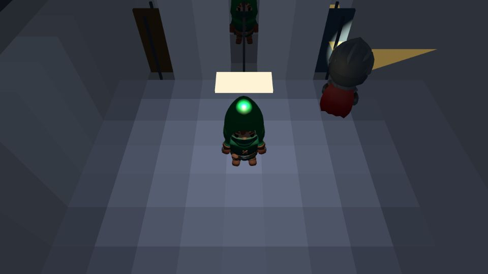
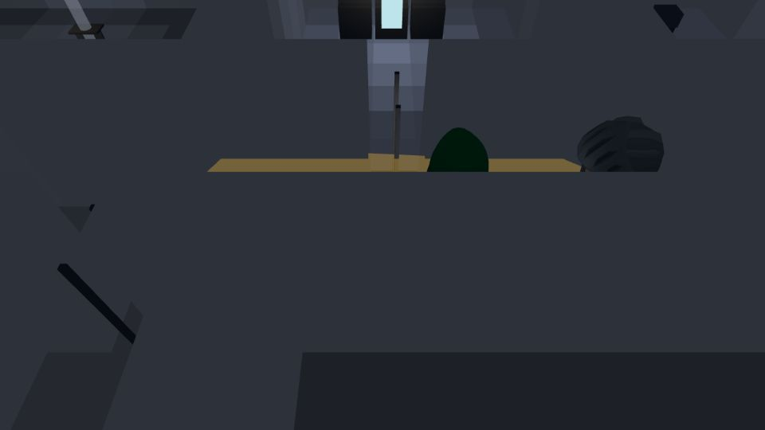
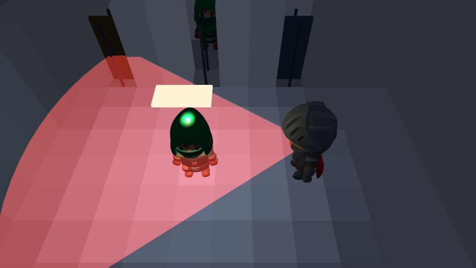
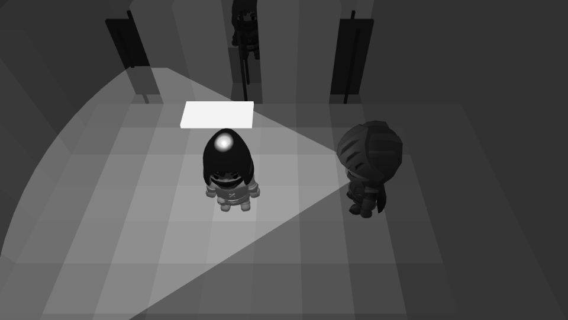

# Tailgate: After Hours

It's 01:00 and the Meridian Mutual HQ tower is down to night staff, a skeleton
guard rotation, and you. Same job as ever: get in, plant the device, get out,
write it up. But now the building has height, the torches sweep real space,
and the dark between the desk pools is genuinely yours.

A real-time 3D stealth game about physical red teaming, played in the
browser. Tailgate through badge gates behind people who hold doors, read
patrol rhythms, throw a bolt to pull a guard off his beat, and hide in the
print room while he searches the corridor outside. Every run ends the only
way a real engagement does: a one-page pentest report, rated GHOST down to
DETAINED, filed before dawn.

Third game in the [Sonofg0tham](https://github.com/Sonofg0tham) security
games series: the 3D reimagining of
[Tailgate](https://github.com/Sonofg0tham/tailgate), after
[Patch Tuesday](https://github.com/Sonofg0tham/patch-tuesday). Tailgate
proved the detection model on a 2D grid. Patch Tuesday proved the
instrument-don't-tune discipline on a systems game. After Hours spends both
proofs on the hard version: the same rules, real space, real light.

Full design in [GAME_DESIGN.md](GAME_DESIGN.md).

## Screenshots

| | |
| --- | --- |
|  |  |
| Crossing a lit pool under a steady patrol beam | A searching guard's torch flick in the dark corridor |
|  |  |
| Hard lock: the beam pins you and the red wash lands | The same moment in greyscale, still readable by shape alone |

## Controls

Keyboard and mouse:

| Input | Action |
| --- | --- |
| WASD or arrow keys | Move (walk) |
| Hold Shift | Creep (crouched, quiet, slower) |
| Hold C | Run (fast, loud) |
| Hold E | Interact: plant the device, photograph secondaries |
| Mouse | Aim the throw arc |
| Hold left mouse, release | Charge and throw a bolt (noise distraction) |
| Escape | Pause (the lanyard: resume, settings, abandon) |

Gamepad (standard mapping): the left stick moves, and how far you push it
sets the pace (a light push creeps, half walks, full runs); the right stick
aims, RT charges and releases the throw, A interacts, Start pauses.

There are no twitch inputs anywhere: every window is generous, nothing is
communicated by colour alone, and motion effects default to calm. Settings
offer HUD scale, high contrast, a visibility floor, motion levels and an
assist mode (guards at 90 percent speed, no penalty).

## The stack, and the trick

Three.js, TypeScript (strict) and Vite. No game engine, no physics library:
character collision is a hand-written capsule against walls extruded from
the floor plan.

**The level is still data.** The floor plan is a 2D grid in JSON, extruded
to 3D geometry at load. All sensing (guard vision, noise, pathfinding,
light) runs on the 2D grid; only the rendering is 3D. The night lighting
keeps that honest by construction: the light grid computes per-cell
brightness with wall occlusion, and the renderer paints those same values
into the floor and wall vertex colours through one monotone curve. A cell
the sim calls dark looks dark. The agreement is a unit test, not a
screenshot.

**One skeleton, zero retargeting.** The operator, the guards and the
cleaners are all CC0 KayKit meshes sharing Kay Lousberg's Rig_Medium
skeleton, so the animation clips (idle, walk, run, crouch-idle, crouch-walk)
bind directly with no Mixamo and no cross-skeleton retargeting step.

**Every sound is synthesised.** No audio files: the alert sting, footsteps
keyed to floor surface, the guard's searching mutter, zone ambience (server
fans, the kitchen fridge, distant city) and the dawn birdsong are all Web
Audio synthesis, positioned with PannerNode and muffled through walls by a
grid line-of-sight lowpass.

**Every run is reproducible.** The sim runs on a fixed timestep with
recorded-input replay; determinism tests replay full missions and assert
identical state. Lighting and audio read the sim and never write it.

It deploys to Vercel as a static build: no backend, no accounts, no
analytics. Settings and run history live in localStorage. CI attaches an
itch.io-ready zip of every build.

## Development

```bash
npm install
npm run dev          # local dev server
npm run build        # production build (typecheck + Vite)
npm run typecheck    # TypeScript, no emit
npm run lint         # ESLint
npm test             # Vitest
npm run balance-run  # drive full missions through the sim, print the worksheet table
```

Every pull request must pass typecheck, lint, the test suite and a gitleaks
secret scan in CI before it can merge to main. Design docs, per-phase
verification notes and the balance worksheets live in [docs/](docs/).

## Licence

Code is [MIT](LICENSE). The bundled character model, animation clips and
fonts are third-party under their own licences, recorded per file in
[CREDITS.md](CREDITS.md) (KayKit models CC0 1.0, fonts SIL OFL 1.1).
